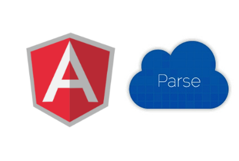

# Angular-parse
> Angular-parse is an Angularjs service to connect to Parse database much more easily and quickly by bypassing entire server side, everything will be handle on client side with Angularjs. This project is only intended for building MVP or prototype.
###Project is terminated, use [Python-parse](https://github.com/nghiattran/python-parse) instead 

[Get started](https://github.com/nghiattran/angular-parse/blob/gh-pages/README.md#get-started)&nbsp;&nbsp;&nbsp;[Request](https://github.com/nghiattran/angular-parse/blob/gh-pages/README.md#requests)&nbsp;&nbsp;&nbsp;[Demo](http://nghiattran.github.io/angular-parse/)

# Get started

### Set keys
	parseServices.setKeysSimple(applicationId, javascriptKey);
You can find your keys in Parse -> Settings -> Keys

### Set pointer type
	parseServices.setPointerMappingSimple(dataStructure);

dataStructure has to be an object containing column names and where the pointers pointing to

Example:
	dataStructure = {
		createdBy: '_User',
		onShelf: 'Shelves'
	}

createdBy and onShelf are column name which are pointing to _User and Shelves classes respectively

# Requests

### Return format

* Success

		response
			\-results						# Data returned from Parse
			\-code 							# Status code

* Fail

		response

			\-error
				\-message					# Error message
				\-code 						# Status code

### Get

	var params = { 
	    where: {
	    	"number" = { "$gt" : 5 }		# Query entries that have "number" value greater than 5
	    },
	    include: ["createdBy"],				# Return object that "createdBy" column pointing to
	    limit: 5							# Limit results to 5 entries
	}
	parseServices.get(table_name, params).then(function(response){
		if (!response.results.error) {
			# do something
		} else{
			# Error
		}
	})

* `params` structure 

		params
			\-where							(Arguments for query)
			\-order 						(Specify a field to sort by)
			\-limit							(Limit the number of objects returned by the query)
			\-skip 							(Use with limit to paginate through results)
			\-keys 							(Restrict the fields returned by the query)
			\-include						(Use on Pointer columns to return the full object)

* Query Constraints

		$lt				Less Than
		$lte			Less Than Or Equal To
		$gt				Greater Than
		$gte			Greater Than Or Equal To
		$ne				Not Equal To
		$in				Contained In
		$nin			Not Contained in
		$exists			A value is set for the key
		$select			This matches a value for a key in the result of a different query
		$dontSelect		Requires that a key's value not match a value for a key in the result of a different query
		$all			Contains all of the given values
		$regex			Requires that a key's value match a regular expression

Angular-parse will converse object_id in 'where' to pointer type. So use

	where: {
    	createdBy: "object_id of an entry"
    },

instead of

	where: {
		createdBy: {
			__type: "Pointer",
			className: "_User",
	    	objectId: "object_id of an entry"
		}
    },

### Post

	parseServices.post(table_name, payload).then(function(reponse){
    	if (!response.results.error) {
			# do something
		} else{
			# Error
		}
    })

### Put

	parseServices.put(table_name, object_id, payload).then(function(reponse){
    	if (!response.results.error) {
			# do something
		} else{
			# Error
		}
    })

### Delete

	parseServices.delete(table_name, objectId).then(function(reponse){
    	if (!response.results.error) {
			# do something
		} else{
			# Error
		}
    })